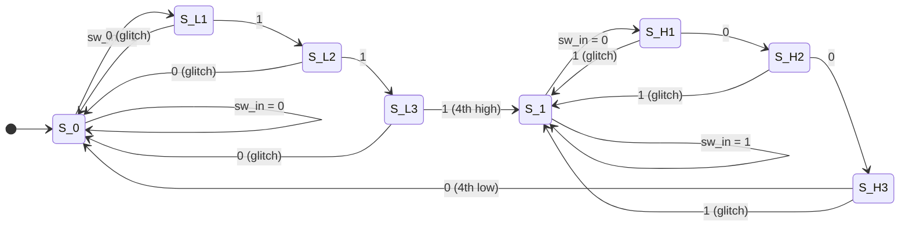

# Switch Debouncer FSM (SystemVerilog)

A robust Finite State Machine (FSM) implementation in SystemVerilog designed to filter out mechanical switch bouncing noise. It ensures a stable digital output by verifying that the input remains unchanged for **4 consecutive clock cycles** before committing a state change.

> **In one line:** the FSM waits until the input holds the exact same value for 4 consecutive clock cycles before updating the clean output.

---

## Table of Contents

1. [Overview & Core Concept](#1-overview--core-concept)
2. [State Machine Architecture](#2-state-machine-architecture)
3. [State Diagram](#3-state-diagram)
4. [State Transition Table](#4-state-transition-table)
5. [Interface](#5-interface)
6. [Reference Implementation](#6-reference-implementation)
7. [Usage Notes](#7-usage-notes)
8. [Simulation](#8-simulation)
9. [License](#9-license)

---

## 1. Overview & Core Concept

### Why debouncing is required

When a mechanical switch or pushbutton is actuated, the metal contacts physically bounce, producing rapid voltage fluctuations (glitches/spikes). At high clock frequencies, a digital system can misinterpret these transitions as multiple distinct trigger events.

This circuit acts as a **4-cycle temporal filter**:

| Signal   | Direction | Description                                                        |
|----------|-----------|--------------------------------------------------------------------|
| `sw_in`  | Input     | Raw, noisy signal directly from the physical contacts              |
| `sw_out` | Output    | Debounced, clean signal produced only after stability is verified  |

### Rule

- Output transitions to **`1`** only after **4 contiguous high cycles**.
- Output reverts to **`0`** only after **4 contiguous low cycles**.
- Any glitch during counting **resets the counter** and returns to the last stable state.

---

## 2. State Machine Architecture

The implementation is a **7-state Moore machine** (output depends only on the current state):

| State  | Output (`sw_out`) | Role                                                     |
|--------|:-----------------:|----------------------------------------------------------|
| `S_0`  | 0 | Stable LOW state                                                 |
| `S_L1` | 0 | High-detection: 1st consecutive `1`                              |
| `S_L2` | 0 | High-detection: 2nd consecutive `1`                              |
| `S_L3` | 0 | High-detection: 3rd consecutive `1`                              |
| `S_1`  | 1 | Stable HIGH state (reached on the 4th consecutive `1`)           |
| `S_H1` | 1 | Low-detection: 1st consecutive `0`                               |
| `S_H2` | 1 | Low-detection: 2nd consecutive `0`                               |
| `S_H3` | 1 | Low-detection: 3rd consecutive `0`                               |

> The Moore output is held at its *old* stable value throughout the counting states, so the output only changes once the 4th matching sample arrives.

---

## 3. State Diagram



---

## 4. State Transition Table

| Current State | `sw_in` | Next State | Output (`sw_out`) of Current State | Condition / Description                          |
|:-------------:|:-------:|:----------:|:----------------------------------:|--------------------------------------------------|
| `S_0`         | 0       | `S_0`      | 0 | Stable LOW output                                                       |
| `S_0`         | 1       | `S_L1`     | 0 | First high cycle detected                                               |
| `S_L1`        | 1       | `S_L2`     | 0 | Second consecutive high cycle                                           |
| `S_L1`        | 0       | `S_0`      | 0 | Glitch detected; reset count to `S_0`                                   |
| `S_L2`        | 1       | `S_L3`     | 0 | Third consecutive high cycle                                            |
| `S_L2`        | 0       | `S_0`      | 0 | Glitch detected; reset count to `S_0`                                   |
| `S_L3`        | 1       | `S_1`      | 0 → 1 | 4th consecutive high cycle achieved. Move to stable HIGH            |
| `S_L3`        | 0       | `S_0`      | 0 | Glitch detected; reset count to `S_0`                                   |
| `S_1`         | 1       | `S_1`      | 1 | Stable HIGH output                                                      |
| `S_1`         | 0       | `S_H1`     | 1 | First low cycle detected                                                |
| `S_H1`        | 0       | `S_H2`     | 1 | Second consecutive low cycle                                            |
| `S_H1`        | 1       | `S_1`      | 1 | Glitch detected; reset count to `S_1`                                   |
| `S_H2`        | 0       | `S_H3`     | 1 | Third consecutive low cycle                                             |
| `S_H2`        | 1       | `S_1`      | 1 | Glitch detected; reset count to `S_1`                                   |
| `S_H3`        | 0       | `S_0`      | 1 → 0 | 4th consecutive low cycle achieved. Move to stable LOW              |
| `S_H3`        | 1       | `S_1`      | 1 | Glitch detected; reset count to `S_1`                                   |

---

## 5. Interface

| Port     | Dir | Width | Description                                   |
|----------|-----|:-----:|-----------------------------------------------|
| `clk`    | in  | 1     | System clock                                  |
| `rst_n`  | in  | 1     | Active-low synchronous reset (returns to `S_0`) |
| `sw_in`  | in  | 1     | Raw switch input (should be synchronized)     |
| `sw_out` | out | 1     | Debounced switch output                       |

---

## 6. Reference Implementation

```systemverilog
module switch_debouncer (
    input  logic clk,
    input  logic rst_n,
    input  logic sw_in,
    output logic sw_out
);

    typedef enum logic [2:0] {
        S_0,
        S_L1,
        S_L2,
        S_L3,
        S_1,
        S_H1,
        S_H2,
        S_H3
    } state_t;

    state_t state, next_state;

    // State register
    always_ff @(posedge clk) begin
        if (!rst_n) state <= S_0;
        else        state <= next_state;
    end

    // Next-state logic
    always_comb begin
        next_state = state;
        unique case (state)
            S_0  : next_state = sw_in ? S_L1 : S_0;
            S_L1 : next_state = sw_in ? S_L2 : S_0;
            S_L2 : next_state = sw_in ? S_L3 : S_0;
            S_L3 : next_state = sw_in ? S_1  : S_0;
            S_1  : next_state = sw_in ? S_1  : S_H1;
            S_H1 : next_state = sw_in ? S_1  : S_H2;
            S_H2 : next_state = sw_in ? S_1  : S_H3;
            S_H3 : next_state = sw_in ? S_1  : S_0;
            default: next_state = S_0;
        endcase
    end

    // Moore output logic
    always_comb begin
        unique case (state)
            S_1, S_H1, S_H2, S_H3: sw_out = 1'b1;
            default:               sw_out = 1'b0;
        endcase
    end

endmodule
```

---

## 7. Usage Notes

- **Synchronize first.** `sw_in` is asynchronous. Pass it through a 2-flip-flop synchronizer before feeding it to the FSM to avoid metastability.
- **Choose your clock wisely.** The filter time is `4 × T_clk`. Mechanical bounce typically lasts 1-20 ms, so either use a slow enable/tick (e.g. a 1 kHz strobe) or extend the design with a larger counter.
- **Latency.** The output changes on the clock edge after the 4th consecutive matching sample is registered, so expect a few cycles of delay from the first stable input.
- **Reset.** `rst_n` forces `S_0` (output LOW). Change the reset state if your switch idles HIGH.

---

## 8. Simulation

Example waveform behaviour (one sample per clock):

```
clk    : _|‾|_|‾|_|‾|_|‾|_|‾|_|‾|_|‾|_|‾|_|‾|_
sw_in  :  0 1 0 1 1 1 1 1 1 0 1 0 0 0 0 0
state  : S0 L1 S0 L1 L2 L3 S1 S1 S1 H1 S1 H1 H2 H3 S0 S0
sw_out :  0 0 0 0 0 0 1 1 1 1 1 1 1 1 0 0
```

To run with a testbench (example using Icarus Verilog / Verilator):

```bash
iverilog -g2012 -o sim switch_debouncer.sv tb_switch_debouncer.sv
vvp sim
```

---

## 9. Output 


## 10. License

Released under the [MIT License](LICENSE).
